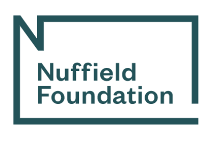

# **Understanding school attendance, education and labour market outcomes ** 

   
**Duration:** May 2022 - August 2024\
**Funding:** Nuffield Foundation

This project has received funding from the Nuffield Foundation.

This project will investigate the impact of school absenteeism on educational attainment and labour market outcomes, and the factors that can mitigate the negative effects of absence.  

Frequent absence from school means students miss not only classroom learning but can also reduce peer interactions, and the development of wide-ranging skills and capabilities.

This study will look in more depth at these issues, considering the consequences of different types of absenteeism for educational attainment and labour market outcomes and whether certain psychosocial (internalising/prosocial behaviour, self-esteem), behavioural (externalising and risky behaviours), and aspirational (education and work) dispositions mediate the link between school absenteeism and educational and labour market outcomes. It will also investigate how these issues vary by socioeconomic status, gender, and ethnicity. 

The researchers will analyse two longitudinal datasets, the Millennium Cohort Study and the 1970 British Cohort Study, to address the research questions:

<ol type = "1">
         <li>Does school absenteeism negatively impact educational attainment and labour market outcomes?</li>
         <li>Does the timing, persistence, or reason for absence influence its impact?</li>
         <li>Do dispositions (psychosocial, behavioural, and aspirational) mitigate the impact of school absenteeism on educational attainment?</li>
         <li>Do dispositions and educational attainment mitigate the impact of school absenteeism on labour market outcomes?</li>
         <li>What is the impact of socio-demographic characteristics for the above questions, focusing on socio-economic status, gender, and ethnicity?</li>
      </ol>

Using data from England, Scotland and Wales, this study will provide evidence about the consequences of school absence for educational and labour market outcomes among different sociodemographic groups, and the mechanisms underlying differences in outcomes to inform policy. The research team will actively engage with policymakers, civil servants, parliamentary committees, practitioners in education, employers, charities, and parent groups to increase the reach of the research. Research briefs, journal articles and a public report will be made available along with a podcast produced by the research team.

