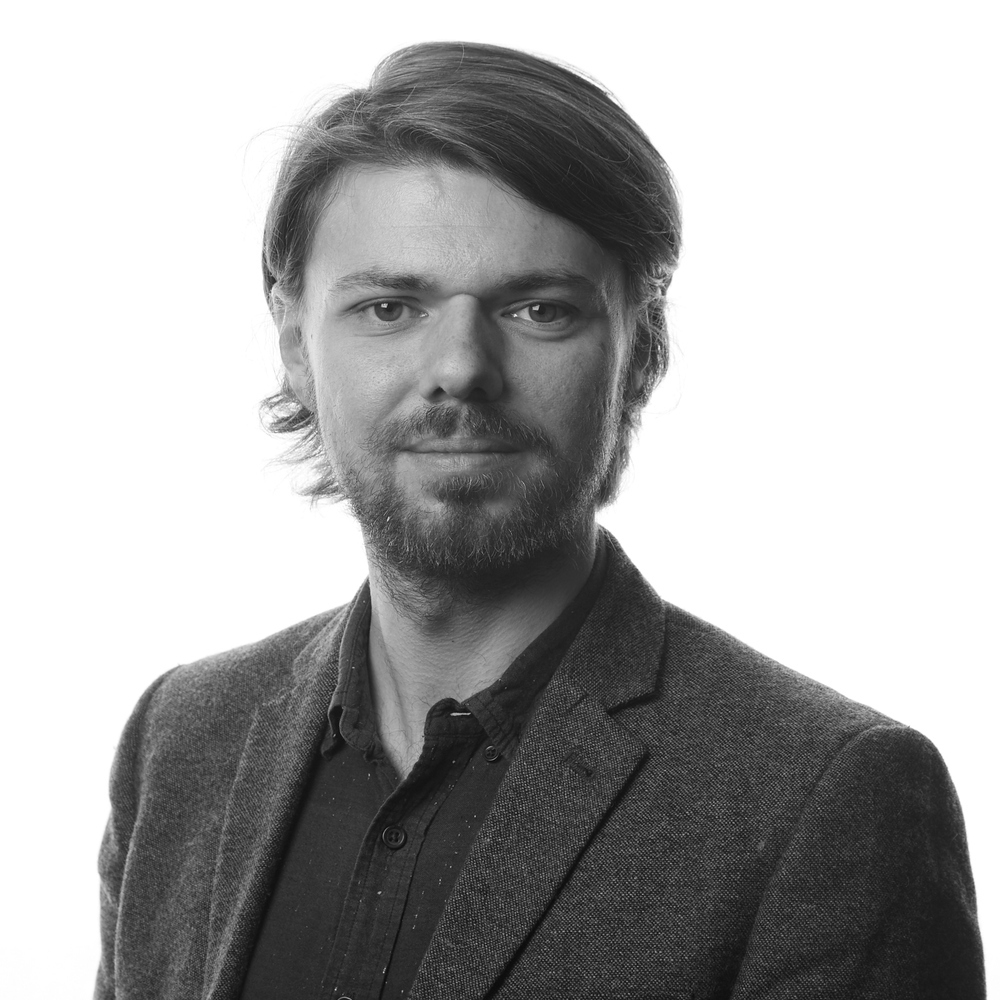
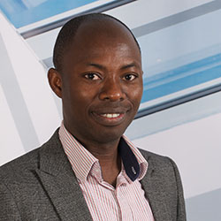
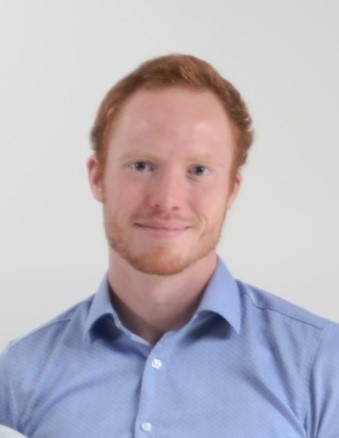
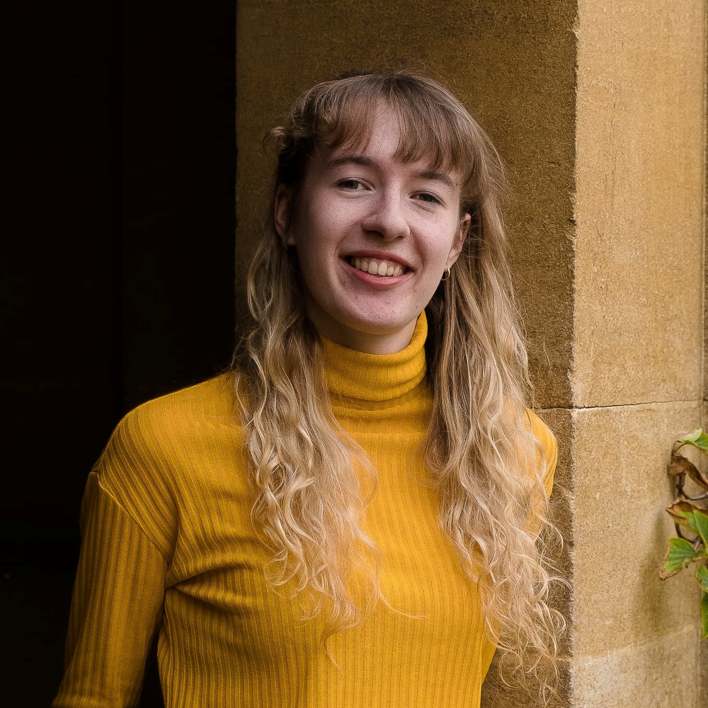
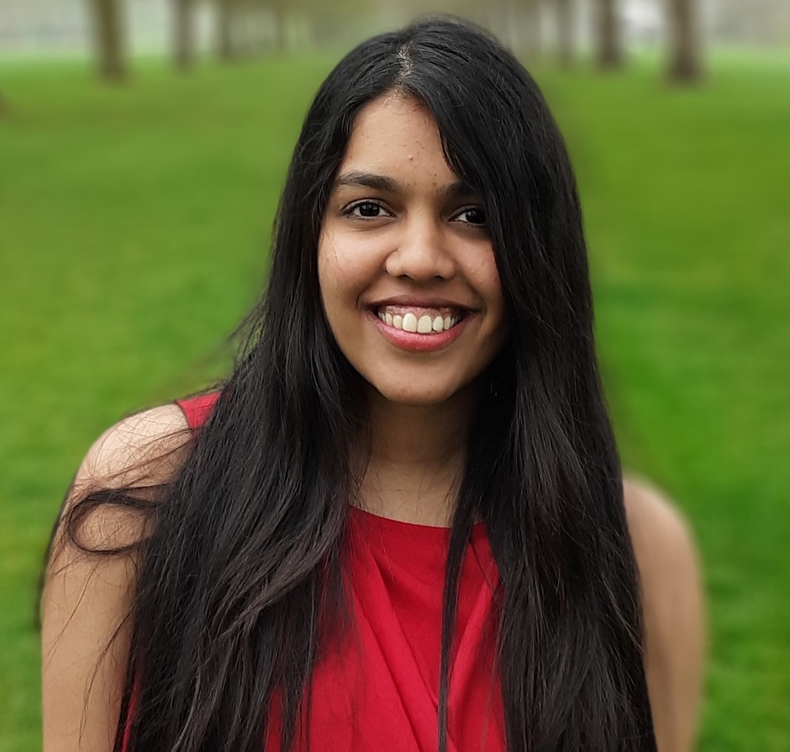

### Project Investigators  

 

**Markus Klein (PI): ** 

Markus Klein is a Senior Lecturer in Human Development and Education Policy in the School of Education at the University of Strathclyde, a Fellow of the Higher Education Academy, and a Life Course Research Affiliate at the ARC Centre of Excellence for Children and Families over the Life Course at the University of Queensland. Previously he was a postdoctoral research fellow in the ‘Social Stratification and Education’ strand of the ESRC-funded research centre AQMeN (Applied Quantitative Methods Network). Markus studies how and why family socioeconomic status shapes individuals’ development and outcomes at various stages of the life course. His research appears in <i>Sociological Science</i>, <i>Child Development</i>, <i>Sociology</i>, <i>British Journal of Sociology</i>, <i>European Sociological Review</i> or <i>Social Science Research.</i>  

 

 

**Edward Sosu (Co-I):**

Edward Sosu is a Reader, and currently Research Director in the School of Education. He has a strong interest in quantitative methods and in addressing educational issues from a psychological perspective. His current research is predominantly focused on understanding how socioeconomic disadvantage influences educational and psychological trajectories from early childhood.  
Edward’s research interest cuts across high-, middle- and low-income country contexts. He was the lead author of the influential Joseph Rowntree Foundation report on [Closing the Attainment Gap In Scottish Education](http://www.jrf.org.uk/sites/files/jrf/education-attainment-scotland-full.pdf). He has extensive experience of policy engagement and is keen to find ways that to enable research outcomes to make a difference to the lives of the most vulnerable in society. 

 

### Research Associates

 

**Jascha Drager: **

Jascha Drager is research associate in the School of Education at the University of Strathclyde. He has a BA in Sociology from the University of Kassel and a MA in Sociology from the University of Mannheim. Previously he has worked as research assistant in the projects <i>“The Effect of Parental Wealth on Education Decisions”</i> at GESIS – Leibniz Institute for the Social Sciences and <i>“The Development of Inequalites in Child Educational Achievement: A Six Country Study Project”</i> at Leipzig University. His main research interests are social stratification in education and quantitative analysis methods. His recent research has been published in <i>Advances in Life Course Research, European Sociological Review, and Research in Social Stratification and Mobility.</i> 

 

### Research Assistants

 

**Esme Lillywhite: **

Esme Lillywhite is currently undertaking PhD research in the School of Education at the University of Strathclyde. Her work is focused on the intergenerational transmission of poverty and she is part of the Institute for Inspiring Children's Futures Doctoral Research Centre. She has a Masters in International Development from Sciences Po, Paris and an BA(Hons) in Politics from the University of Exeter. Her research interests include quantitative methods, stratification in education, inequality, and social mobility.

 

 

**Kenvil Souza: **

Kenvil Souza is a PhD student in psychology at the University of Strathclyde. Her research focusses on the association between childhood experiences and suicide risk through the application and testing of theoretical models. Previously, she completed her MSc in psychological science (conversion) at the University of Glasgow and assisted on research projects focussed on guidelines for digital play in children, perception of facial cues in social robots, etc.

 

### Previous Research Associates  
[Dr Shadrach Dare](https://discovery.dundee.ac.uk/en/persons/shadrach-dare)  
[Dr Claire Goodfellow](https://www.researchgate.net/profile/Claire-Goodfellow)      

### Partners  
[General Teaching Council for Scotland](https://www.gtcs.org.uk/)  
[Poverty Alliance](https://www.povertyalliance.org/)

