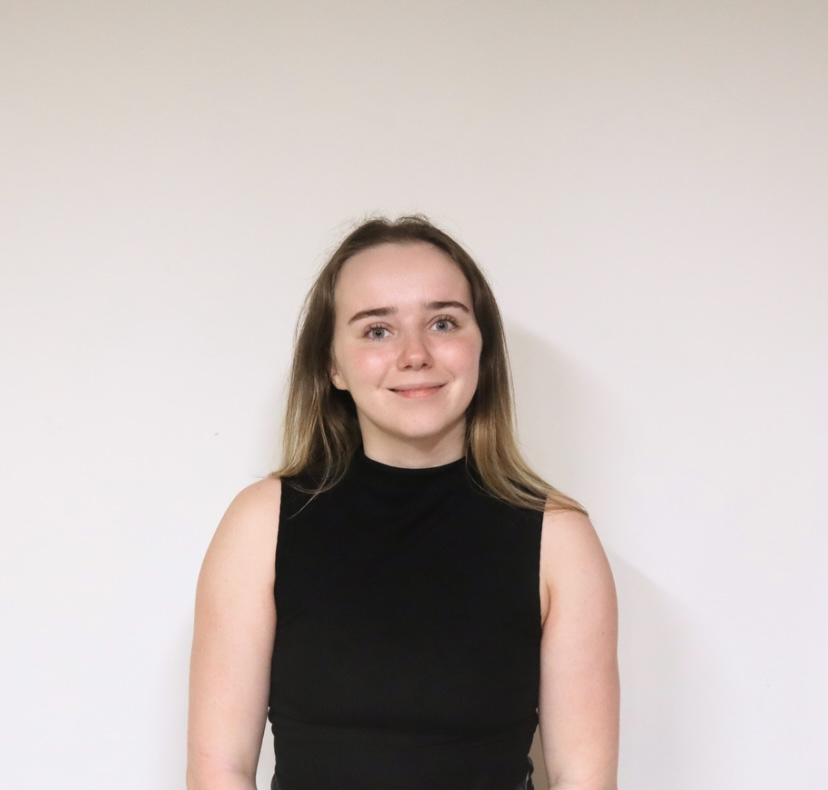

### Project Investigators  

 

**Markus Klein (PI): ** 

Dr Markus Klein is a Professor of Human Development and Education Policy and currently Director of Research in the Institute of Education at the University of Strathclyde, a Fellow of the Higher Education Academy, and a Life Course Research Affiliate at the ARC Centre of Excellence for Children and Families over the Life Course at the University of Queensland. Previously he was a postdoctoral research fellow in the ‘Social Stratification and Education’ strand of the ESRC-funded research centre AQMeN (Applied Quantitative Methods Network). Markus obtained a PhD from the University of Mannheim, Germany. He studies how and why family socioeconomic status shapes individuals’ development and outcomes at various stages of the life course. His research appears in <i>Sociological Science</i>, <i>Child Development</i>, <i>Sociology</i>, <i>British Journal of Sociology</i>, <i>European Sociological Review</i> or <i>Social Science Research.</i>  

 

 

**Edward Sosu (Co-I):**

Dr Edward Sosu is a Professor and Director of Research in the School of Education at the University of Glasgwo. He has a strong interest in quantitative methods and in addressing educational issues from a psychological perspective. His current research is predominantly focused on understanding how socioeconomic disadvantage influences educational and psychological trajectories from early childhood.  
Edward’s research interest cuts across high-, middle- and low-income country contexts. He was the lead author of the influential Joseph Rowntree Foundation report on [Closing the Attainment Gap In Scottish Education](http://www.jrf.org.uk/sites/files/jrf/education-attainment-scotland-full.pdf). He has extensive experience of policy engagement and is keen to find ways that to enable research outcomes to make a difference to the lives of the most vulnerable in society. 

 

### Research Assistant

 

**Samara Marta: **

Samara Marta is an ESRC 1+3 PhD student at the University of Strathclyde. Her project examines the role of behavioural and psychosocial dispositions in the relationship between family socioeconomic status and school absenteeism. She is currently completing her MSc in Applied Educational and Social Research and previously completed her BSc in Psychology in Education at the University of York. Her research interests include school absenteeism, quantitative methods, and addressing inequalities.

 

### Previous Research Associates

[Valentina Perinetti Casoni](https://www.thebridgegroup.org.uk/ourstaff)  
[Dr Jascha Dräger](https://www.diw.de/de/diw_01.c.881111.de/personen/draeger__jascha.html)  
[Dr Shadrach Dare](https://www.gcu.ac.uk/staff/shadrachdare)  
[Dr Claire Goodfellow](https://www.researchgate.net/profile/Claire-Goodfellow)      

### Partners ESRC Project  
[General Teaching Council for Scotland](https://www.gtcs.org.uk/)  
[Poverty Alliance](https://www.povertyalliance.org/)     

### Advisory Group Nuffield Foundation Project
Dr Markus Gehrsitz (University of Strathclyde)   
Dr carol Brown (Oxford Brookes University)   
Dr Daniel Burley (Senior Research Officer, School Research, Welsh Government)   
Fiona Wager (Learning Directorate, Scottish Government)   
Jamila Boughleaf (Programme Manager, Education Endowment Foundation)   
Jacqui Ward (Attainment Advisor, Education Scotland)   
Patrick Watt (Head of Evaluation & Research, Skills Development Scotland)   
Jason Elsom (CEO, Parentkind)   
Emily Hunt (Associate Director, Social Mobility and Vulnerable Learners, Education Policy Institute)

