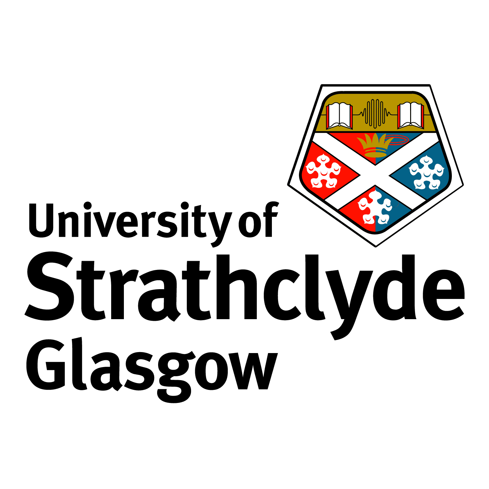

# **Family background and educational attainment: An investigation into the mediating role of school absenteeism**

**Duration:** 1 September 2018 – 31 March 2022  
**Funding:** Economic and Social Research Council (ESRC)  
\
This project has received funding from the Economic and Social Research Council (ESRC) under the Secondary Data Analysis Initiative (SDAI), grant reference ES/R004943/1\
\
Our ESRC-funded project aims to investigate the extent to which differences in school attendance accounts for socioeconomic inequalities in educational attainment and post-school destinations among pupils in Scotland.\

We invite you to browse and explore our website to learn more about the project and hope that you may revisit to check for any updates or new publications that we disseminate through this website in the future.\

Thank you for your interest in our work!\

Markus Klein (PI) and Edward Sosu (Co-I)\

